# Agent-Based Architecture Migration

## Overview

Replace direct model selection with agent selection, where each agent encapsulates a model, prompt, and per-agent permissions. Configuration will use JSON (extending existing `squid.config.json`) instead of TOML.

## Key Simplifications

Based on your requirements:

- **Breaking changes OK**: No backward compatibility code needed
- **JSON config**: Extends existing `squid.config.json` format
- **Rename UI components**: Use Agent* naming throughout
- **Simplified migration**: Minimal code, focused implementation
- **Remove model proxying**: All agents defined in config file

## Architecture Changes

### Configuration Schema

Your proposed JSON structure is good, with minor adjustments:

```json
{
  "agents": {
    "code-reviewer": {
      "name": "Code Reviewer",
      "enabled": true,
      "description": "Reviews code for best practices and potential issues",
      "model": "anthropic/claude-sonnet-4-5",
      "prompt": "You are a code reviewer. Focus on security, performance, and maintainability.",
      "permissions": {
        "allow": ["now", "read_file", "grep"],
        "deny": ["write_file", "bash"]
      }
    },
    "general-assistant": {
      "name": "General Assistant",
      "enabled": true,
      "description": "Full-featured coding assistant",
      "model": "qwen2.5-coder-7b-instruct",
      "permissions": {
        "allow": ["now", "read_file", "write_file", "grep", "bash"],
        "deny": []
      }
    }
  },
  "default_agent": "general-assistant"
}
```

**Key additions to your proposal:**

- Added `name` field (display name separate from ID key)
- Made `agents` an object (not array) for easy lookup by ID

### Data Flow

```mermaid
flowchart LR
    configFile[squid.config.json] --> backend[Backend Config Loader]
    backend --> agentMap[HashMap Agent ID to AgentConfig]
    agentMap --> apiAgents[GET /api/agents]
    apiAgents --> frontend[Frontend Agent Store]
    frontend --> ui[Agent Selector UI]
    ui --> chatReq[Chat Request with agent_id]
    chatReq --> permCheck[Permission Check per Agent]
    permCheck --> llmCall[LLM API Call with agent.model]
```




## Backend Implementation

### 1. Agent Configuration Module

**File**: `[src/agent.rs](src/agent.rs)` (new file)

Create core agent data structures:

```rust
use serde::{Deserialize, Serialize};
use std::collections::HashMap;

#[derive(Debug, Clone, Serialize, Deserialize)]
pub struct AgentPermissions {
    #[serde(default)]
    pub allow: Vec<String>,
    #[serde(default)]
    pub deny: Vec<String>,
}

#[derive(Debug, Clone, Serialize, Deserialize)]
pub struct AgentConfig {
    pub name: String,
    #[serde(default = "default_true")]
    pub enabled: bool,
    pub description: String,
    pub model: String,
    #[serde(skip_serializing_if = "Option::is_none")]
    pub prompt: Option<String>,
    #[serde(default)]
    pub permissions: AgentPermissions,
}

#[derive(Debug, Clone, Serialize, Deserialize, Default)]
pub struct AgentsConfig {
    #[serde(default)]
    pub agents: HashMap<String, AgentConfig>,
    #[serde(default = "default_agent_id")]
    pub default_agent: String,
}

fn default_true() -> bool { true }
fn default_agent_id() -> String { "general-assistant".to_string() }
```

### 2. Update Configuration

**File**: `[src/config.rs](src/config.rs)`

Add agents field to `Config` struct:

```rust
#[derive(Debug, Clone, Serialize, Deserialize)]
pub struct Config {
    // ... existing fields ...
    #[serde(default)]
    pub agents: AgentsConfig,
}
```

Add helper methods:

```rust
impl Config {
    pub fn get_agent(&self, agent_id: &str) -> Option<&AgentConfig> {
        self.agents.agents.get(agent_id)
    }
    
    pub fn get_agent_permissions(&self, agent_id: &str) -> Option<&AgentPermissions> {
        self.get_agent(agent_id).map(|a| &a.permissions)
    }
    
    pub fn get_default_agent(&self) -> Option<&AgentConfig> {
        self.get_agent(&self.agents.default_agent)
    }
}
```

### 3. Update Permission Checking

**File**: `[src/tools.rs](src/tools.rs)`

Update `check_tool_permission()` to accept agent_id:

**Current signature** (line 339):

```rust
pub fn check_tool_permission(
    name: &str,
    args: &serde_json::Value,
    config: &Config,
) -> ToolPermissionStatus
```

**New signature**:

```rust
pub fn check_tool_permission(
    name: &str,
    args: &serde_json::Value,
    agent_id: &str,
    config: &Config,
) -> ToolPermissionStatus {
    // 1. Security checks first (unchanged)
    if name == "bash" {
        // ... existing dangerous command blocking ...
    }
    
    // 2. Get agent-specific permissions
    let permissions = match config.get_agent_permissions(agent_id) {
        Some(p) => p,
        None => {
            warn!("Agent '{}' not found, denying all tools", agent_id);
            return ToolPermissionStatus::Denied {
                reason: format!("Agent '{}' not found", agent_id),
            };
        }
    };
    
    // 3. Check deny list
    if permissions.deny.contains(&name.to_string()) {
        return ToolPermissionStatus::Denied {
            reason: format!("Tool '{}' denied by agent", name),
        };
    }
    
    // 4. Check allow list
    if permissions.allow.contains(&name.to_string()) {
        return ToolPermissionStatus::Allowed;
    }
    
    // 5. Default: needs approval
    ToolPermissionStatus::NeedsApproval
}
```

**Update call sites** in `src/api.rs` (line 1132) and `src/tools.rs` (lines 570, 634).

### 4. API Endpoints

**File**: `[src/api.rs](src/api.rs)`

**Add response structs**:

```rust
#[derive(Debug, Serialize)]
pub struct AgentInfo {
    pub id: String,
    pub name: String,
    pub description: String,
    pub model: String,
    pub enabled: bool,
    pub permissions: agent::AgentPermissions,
}

#[derive(Debug, Serialize)]
pub struct AgentsResponse {
    pub agents: Vec<AgentInfo>,
    pub default_agent: String,
}
```

**Add GET /api/agents handler**:

```rust
pub async fn get_agents(
    app_config: web::Data<Arc<config::Config>>,
) -> Result<HttpResponse, Error> {
    let agents: Vec<AgentInfo> = app_config
        .agents
        .agents
        .iter()
        .filter(|(_, agent)| agent.enabled)
        .map(|(id, agent)| AgentInfo {
            id: id.clone(),
            name: agent.name.clone(),
            description: agent.description.clone(),
            model: agent.model.clone(),
            enabled: agent.enabled,
            permissions: agent.permissions.clone(),
        })
        .collect();

    Ok(HttpResponse::Ok().json(AgentsResponse {
        agents,
        default_agent: app_config.agents.default_agent.clone(),
    }))
}
```

**Update ChatRequest struct**:

```rust
#[derive(Debug, Deserialize)]
pub struct ChatRequest {
    pub message: String,
    pub agent_id: String,  // Required field (not optional)
    // ... rest unchanged ...
}
```

**Update create_chat_stream**:

In the function signature and body, replace model references with agent:

```rust
async fn create_chat_stream(
    // ... other params ...
    agent_id: String,
    // ...
) -> impl Stream<Item = Result<StreamEvent, Error>> {
    async_stream::stream! {
        // Get agent config
        let agent = match app_config.get_agent(&agent_id) {
            Some(a) => a,
            None => {
                yield Ok(StreamEvent::Error {
                    message: format!("Agent '{}' not found", agent_id),
                });
                return;
            }
        };
        
        let model_id = agent.model.clone();
        let system_prompt = agent.prompt.clone()
            .or(system_prompt)
            .unwrap_or_default();
        
        // ... rest of function, passing agent_id to permission checks ...
    }
}
```

**Register route** in `[src/server.rs](src/server.rs)`:

```rust
web::scope("/api")
    .route("/agents", web::get().to(api::get_agents))
    // ... other routes ...
```

## Frontend Implementation

### 5. Update API Client

**File**: `[web/src/lib/chat-api.ts](web/src/lib/chat-api.ts)`

**Add interfaces**:

```typescript
export interface AgentInfo {
  id: string;
  name: string;
  description: string;
  model: string;
  enabled: boolean;
  permissions: {
    allow: string[];
    deny: string[];
  };
}

export interface AgentsResponse {
  agents: AgentInfo[];
  default_agent: string;
}
```

**Add fetchAgents function**:

```typescript
export async function fetchAgents(baseUrl: string): Promise<AgentsResponse> {
  const endpoint = `${baseUrl}/api/agents`;
  const response = await fetch(endpoint);
  
  if (!response.ok) {
    throw new Error(`Failed to fetch agents: ${response.statusText}`);
  }
  
  return response.json();
}
```

**Update streamChat** to use agent_id:

```typescript
export async function streamChat(
  message: string,
  handlers: StreamHandlers,
  options: {
    agentId: string;  // Changed from modelId
    // ... rest unchanged ...
  }
): Promise<void> {
  // ...
  body: JSON.stringify({
    message,
    agent_id: options.agentId,  // Required field
    // ...
  }),
}
```

### 6. Create Agent Store

**File**: `[web/src/stores/agent-store.ts](web/src/stores/agent-store.ts)` (rename from model-store.ts)

Rename all model references to agent:

- `ModelStore` → `AgentStore`
- `ModelInfo` → `AgentInfo`
- `models` → `agents`
- `selectedModel` → `selectedAgent`
- `loadModels()` → `loadAgents()`
- Storage key: `'agent-storage'`

Key changes in implementation:

```typescript
interface AgentStore {
  agents: AgentInfo[];
  agentGroups: string[];  // Providers
  selectedAgent: string;
  sessionAgentId: string | null;
  // ... rest similar ...
}

export const useAgentStore = create<AgentStore>()(
  persist(
    (set, get) => ({
      loadAgents: async () => {
        const [{ agents, default_agent }, config] = await Promise.all([
          fetchAgents(''),
          fetchConfig(''),
        ]);
        // ... rest of logic ...
      },
      // ...
    }),
    { name: 'agent-storage' }
  )
);
```

### 7. Rename UI Components

Since AGENTS.md says not to modify ai-elements, we'll create new agent-specific wrappers:

**File**: `[web/src/components/app/agent-selector.tsx](web/src/components/app/agent-selector.tsx)` (new)

```typescript
import { ModelSelector, ModelSelectorTrigger, ... } from '@/components/ai-elements/model-selector';

// Re-export with agent names for clarity in app code
export const AgentSelector = ModelSelector;
export const AgentSelectorTrigger = ModelSelectorTrigger;
export const AgentSelectorContent = ModelSelectorContent;
// ... etc for all components
```

**File**: `[web/src/components/app/agent-item.tsx](web/src/components/app/agent-item.tsx)` (rename from model-item.tsx)

```typescript
export const AgentItem = ({
  agent,
  isSelected,
  onSelect,
}: {
  agent: AgentInfo;
  isSelected: boolean;
  onSelect: (id: string) => void;
}) => {
  return (
    <ModelSelectorItem onSelect={() => onSelect(agent.id)}>
      <div className="flex flex-col flex-1">
        <ModelSelectorName>{agent.name}</ModelSelectorName>
        <span className="text-xs text-muted-foreground">
          {agent.description}
        </span>
        <span className="text-xs text-muted-foreground/60 mt-0.5">
          Model: {agent.model}
        </span>
      </div>
      {isSelected && <CheckIcon className="ml-2 size-4" />}
    </ModelSelectorItem>
  );
};
```

**File**: `[web/src/components/app/chatbot.tsx](web/src/components/app/chatbot.tsx)`

Update imports and usage:

```typescript
import { useAgentStore } from '@/stores/agent-store';
import { AgentSelector, AgentSelectorTrigger, ... } from './agent-selector';
import { AgentItem } from './agent-item';

// In component:
const {
  agents,
  selectedAgent,
  loadAgents,
  setSelectedAgent,
} = useAgentStore();

// In JSX:
<AgentSelector>
  <AgentSelectorTrigger>
    <ModelSelectorName>{selectedAgentData?.name || "Select agent..."}</ModelSelectorName>
  </AgentSelectorTrigger>
  <AgentSelectorContent title="Select Agent">
    {/* ... render agents ... */}
  </AgentSelectorContent>
</AgentSelector>

// In streamChat call:
await streamChat(text, handlers, {
  agentId: selectedAgent,
  // ...
});
```

Repeat similar changes for `[web/src/components/app/file-viewer.tsx](web/src/components/app/file-viewer.tsx)`.

## Documentation

### 8. Update README.md

Add comprehensive agents section:

```markdown
## Agents

Squid uses an agent-based architecture. Each agent has:
- A specific model (e.g., GPT-4, Claude, local model)
- Custom system prompt
- Tool permissions (allow/deny lists)

### Configuration

Edit `squid.config.json`:

```json
{
  "agents": {
    "code-reviewer": {
      "name": "Code Reviewer",
      "enabled": true,
      "description": "Reviews code for best practices",
      "model": "anthropic/claude-sonnet-4-5",
      "prompt": "You are a code reviewer...",
      "permissions": {
        "allow": ["now", "read_file", "grep"],
        "deny": ["write_file", "bash"]
      }
    }
  },
  "default_agent": "code-reviewer"
}
```

### Agent Properties

- **name**: Display name in UI
- **enabled**: Show in agent selector
- **description**: Brief purpose description
- **model**: Underlying LLM (e.g., "gpt-4o", "qwen2.5-coder-7b-instruct")
- **prompt**: Optional system prompt override
- **permissions.allow**: Tools that run without confirmation
- **permissions.deny**: Tools that are blocked

```

### 9. Update CHANGELOG.md

```markdown
## [Unreleased]

### Added
- Agent-based architecture with per-agent configuration
- Agent selector in UI showing descriptions and models
- Per-agent tool permissions
- `/api/agents` endpoint

### Changed
- **BREAKING**: Configuration now uses agents instead of single model
- **BREAKING**: API endpoints use `agent_id` instead of `model`
- **BREAKING**: Frontend components renamed from Model* to Agent*

### Removed
- Model proxying from LM Studio/Ollama
- Global permissions (now per-agent)
```

### 10. Example Configuration

**File**: `[sample-files/agents-example.json](sample-files/agents-example.json)` (new)

```json
{
  "agents": {
    "general-assistant": {
      "name": "General Assistant",
      "enabled": true,
      "description": "Full-featured coding assistant",
      "model": "qwen2.5-coder-7b-instruct",
      "permissions": {
        "allow": ["now", "read_file", "write_file", "grep", "bash"],
        "deny": []
      }
    },
    "code-reviewer": {
      "name": "Code Reviewer",
      "enabled": true,
      "description": "Reviews code for quality and security",
      "model": "anthropic/claude-sonnet-4-5",
      "prompt": "You are an expert code reviewer...",
      "permissions": {
        "allow": ["now", "read_file", "grep"],
        "deny": ["write_file", "bash"]
      }
    },
    "safe-explorer": {
      "name": "Safe Explorer",
      "enabled": true,
      "description": "Read-only code exploration",
      "model": "qwen2.5-coder-7b-instruct",
      "permissions": {
        "allow": ["now", "read_file", "grep"],
        "deny": ["write_file", "bash"]
      }
    }
  },
  "default_agent": "general-assistant"
}
```

## Testing Strategy

### Backend

- Agent lookup by ID
- Permission checking with agent context
- `/api/agents` endpoint response format
- Chat stream uses correct agent model and prompt
- Tool execution respects agent permissions

### Frontend

- Agent store loads from API
- Agent selector displays all enabled agents
- Agent selection persists across sessions
- Chat requests include correct `agent_id`

### Integration

- End-to-end chat with agent selection
- Tool approval/denial based on agent permissions
- System prompts applied correctly per agent

## Key Design Decisions

1. **JSON over TOML**: Extends existing `squid.config.json`, familiar format
2. **Agents as object keys**: Fast HashMap lookup, clean structure
3. **Breaking changes**: No backward compatibility = simpler code
4. **Agent wrappers**: Keep ai-elements unchanged per AGENTS.md, wrap in app layer
5. **Required agent_id**: No fallbacks, explicit selection required

## Files Summary

### New Files

- `src/agent.rs` - Agent data structures
- `web/src/stores/agent-store.ts` - Frontend agent state
- `web/src/components/app/agent-selector.tsx` - UI wrappers
- `web/src/components/app/agent-item.tsx` - Agent list item
- `sample-files/agents-example.json` - Example config

### Modified Files

- `src/config.rs` - Add agents field and helpers
- `src/tools.rs` - Update permission checking with agent_id
- `src/api.rs` - Add agents endpoint, update chat handler
- `src/server.rs` - Register agents route
- `web/src/lib/chat-api.ts` - Add fetchAgents, update types
- `web/src/components/app/chatbot.tsx` - Use agent store and UI
- `web/src/components/app/file-viewer.tsx` - Use agent store and UI
- `README.md` - Document agent system
- `CHANGELOG.md` - Document breaking changes

### Deleted Files

- `web/src/stores/model-store.ts` (renamed to agent-store.ts)
- `web/src/components/app/model-item.tsx` (renamed to agent-item.tsx)

