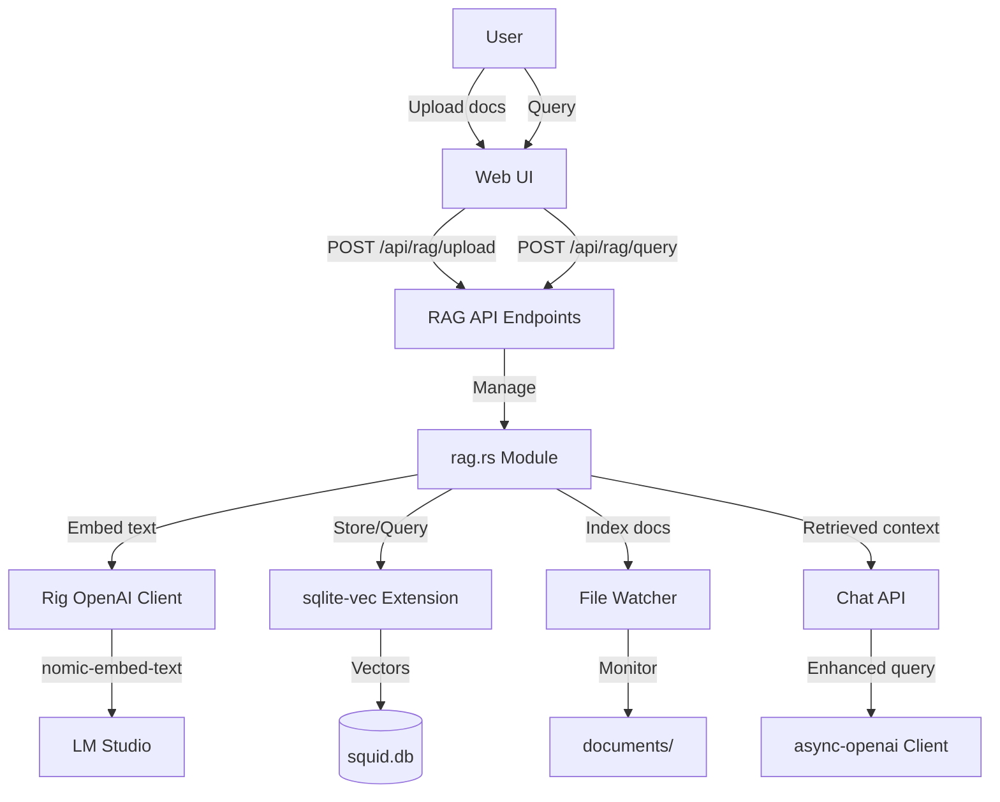

# RAG Integration Plan

## Overview

Add RAG support to enable context-aware queries over user documents. The implementation will use Rig for embeddings (via nomic-embed-text), sqlite-vec for persistent vector storage, and provide a Web UI for document management.

## Architecture




## Implementation Steps

### 1. Database Schema (sqlite-vec integration)

Create new migration file `[migrations/011_rag_vectors.sql](migrations/011_rag_vectors.sql)`:

- Add `rag_documents` table: id, filename, content, content_hash, created_at, updated_at
- Add `vec0` virtual table for embeddings: rowid, document_id, chunk_text, embedding float[768]
- Add indexes for efficient lookups
- Document chunks stored with references to source documents

**Note**: nomic-embed-text produces 768-dimensional vectors

### 2. Core RAG Module (`[src/rag.rs](src/rag.rs)`)

New module with following components:

#### a. Rig Integration

- `RagEmbedder` struct wrapping Rig's OpenAI client
- Configure with LM Studio URL from config (`http://localhost:11434/v1`)
- Use `nomic-embed-text` model for embeddings
- Batch embedding support for efficiency

#### b. Document Management

- `DocumentManager` for chunking documents (500-1000 token chunks with overlap)
- SHA256 content hashing to detect changes
- Text extraction (start with .md, .txt, .rs, .py, .js, .ts, etc.)
- Support for multiple document formats
- **Documents path**: Relative to current working directory where `squid serve` is run
  - If user runs `squid serve --dir /path/to/workspace`, looks for `/path/to/workspace/documents/`
  - Consistent with existing config file and database path resolution

#### c. Vector Store Interface

- `VectorStore` trait for abstraction
- `SqliteVecStore` implementation using sqlite-vec
- Insert, query (KNN search), delete operations
- Retrieve top-k similar chunks with scores

#### d. Document Watcher

- `DocumentWatcher` using `notify` crate
- Monitor `documents/` directory **relative to current working directory**
- **Incremental updates only**: Handle file add/modify/delete events
- Debouncing to prevent excessive reindexing
- Respects `--dir` flag from `squid serve` command
- Does NOT perform full scan on startup (use `squid rag init` for that)

#### e. RAG Query Pipeline

- `RagQuery::execute()`: embed query → retrieve context → format for LLM
- Return top-k chunks with metadata (filename, score)
- Format retrieved context with source attribution

#### f. RAG Indexer (for CLI commands)

- `RagIndexer::scan_and_index()`: Full directory scan and batch indexing
- `RagIndexer::get_stats()`: Document and embedding counts
- Progress reporting for CLI (using `indicatif` crate, already in dependencies)
- Skip already-indexed documents (compare content hash)

### 3. API Endpoints (`[src/api.rs](src/api.rs)`)

Add new endpoints:

- `POST /api/rag/upload` - Upload document, extract text, chunk, embed, store
- `GET /api/rag/documents` - List indexed documents with metadata
- `DELETE /api/rag/documents/{id}` - Remove document and its embeddings
- `POST /api/rag/query` - RAG-enhanced chat query
- `POST /api/rag/rebuild` - Manual index rebuild

**Integration with existing chat**: Modify `chat_stream` to accept optional `use_rag` flag

### 4. Configuration Updates (`[src/config.rs](src/config.rs)`)

Add to `Config` struct:

```rust
#[serde(default = "default_rag_config")]
pub rag: RagConfig,

pub struct RagConfig {
    pub enabled: bool,
    pub embedding_model: String, // "nomic-embed-text"
    pub embedding_url: String,   // LM Studio URL
    pub chunk_size: usize,       // 512 tokens
    pub chunk_overlap: usize,    // 50 tokens
    pub top_k: usize,            // 5 results
}
```

### 5. Demo Content

Create demo documents for development and user onboarding:

#### a. Development Demo Docs (in squid repo)

Create `documents/` folder in the squid project root with sample files:

- `documents/getting-started.md` - Quick start guide with code examples
- `documents/rag-guide.md` - How to use RAG features, example queries
- `documents/rust-examples.rs` - Sample Rust code for testing code retrieval
- `documents/api-reference.md` - Squid API and tool documentation excerpts

**Purpose**: Developers can test RAG features immediately without creating test content.

#### b. User Demo Templates (embedded in binary)

Create templates in `src/assets/demo_docs/`:

- `src/assets/demo_docs/getting-started.md` - Squid introduction
- `src/assets/demo_docs/rag-guide.md` - RAG features guide  
- `src/assets/demo_docs/example-project.md` - Sample project documentation

**Deployment**: When user runs `squid init --create-demo-docs`, these files are written to `./documents/` in their workspace, similar to how `.squidignore.example` is handled.

### 6. Dependencies (`[Cargo.toml](Cargo.toml)`)

Add:

- `rig-core = "0.2"` - Embeddings and retrieval
- `notify = "6.0"` - File watching
- `rusqlite` (already present) - Ensure sqlite-vec loadable extension support
- Download sqlite-vec extension binary for target platform

### 6. CLI Commands (`[src/main.rs](src/main.rs)`)

Add new `Rag` command with subcommands:

```rust
/// RAG (Retrieval-Augmented Generation) operations
Rag {
    #[command(subcommand)]
    command: RagCommands,
}

enum RagCommands {
    /// Initialize RAG index by scanning and embedding documents
    Init {
        /// Custom documents directory (defaults to ./documents)
        #[arg(long)]
        dir: Option<PathBuf>,
    },
    /// List indexed documents
    List,
    /// Rebuild the entire RAG index
    Rebuild {
        #[arg(long)]
        dir: Option<PathBuf>,
    },
    /// Show RAG statistics (document count, embedding count, etc.)
    Stats,
}
```

**Update `Commands::Init`** to optionally create demo RAG documents:

- Add `--create-demo-docs` flag to existing `squid init` command
- When enabled, create `documents/` folder with sample files:
  - `getting-started.md` - Basic squid usage guide
  - `rag-guide.md` - How to use RAG features  
  - `example-project.md` - Sample project documentation
- Demo docs embedded in binary using `include_str!()` (like `.squidignore.example`)
- Can skip prompts with `--no-rag` or `--demo-docs` flags for non-interactive use
- Files are only created if `documents/` doesn't exist or is empty

**Benefits of `squid rag init`**:

- Pre-index documents before starting server (no startup delay)
- Useful for CI/CD pipelines
- Batch processing for large document sets
- Can be run independently without starting the web server

### 7. Main Module Updates

- Add `mod rag;` declaration
- Handle `Commands::Rag` branch with appropriate subcommand logic
- Initialize `DocumentWatcher` in `serve` command startup (after pre-indexing check)
  - After `set_current_dir()` if `--dir` flag is used
  - Watch `./documents/` relative to working directory
  - Only handle incremental updates (add/modify/delete)
  - Skip initial scan if index already exists
- Load sqlite-vec extension on database connection

### 7. RAG Configuration in Config

Add `documents_path` option to `RagConfig`:

```rust
pub struct RagConfig {
    pub enabled: bool,
    pub embedding_model: String,
    pub embedding_url: String,
    pub chunk_size: usize,
    pub chunk_overlap: usize,
    pub top_k: usize,
    #[serde(default = "default_documents_path")]
    pub documents_path: String,  // "./documents"
}
```

### 8. Database Module (`[src/db.rs](src/db.rs)`)

Extend `Database` struct:

- Load sqlite-vec extension via `load_extension()`
- Helper methods: `get_rag_documents()`, `delete_rag_document()`, etc.
- Vector operations wrapped in safe Rust API

### 8. Updated Init Command Flow

Extend existing `Commands::Init` interactive prompts (after log level):

```rust
// After existing prompts (API URL, model, key, context window, log level)

// RAG Setup Prompt
let setup_rag = if rag_enabled_arg.is_some() {
    rag_enabled_arg.unwrap()
} else {
    inquire::Confirm::new("Set up RAG (Retrieval-Augmented Generation)?")
        .with_default(true)
        .with_help_message("Enable semantic document search for context-aware responses")
        .prompt()
        .unwrap_or(false)
};

if setup_rag {
    let create_demo = if demo_docs_arg.is_some() {
        demo_docs_arg.unwrap()
    } else {
        inquire::Confirm::new("Create demo documents for testing?")
            .with_default(true)
            .with_help_message("Adds 3 sample documents to ./documents/ to try RAG features")
            .prompt()
            .unwrap_or(false)
    };
    
    if create_demo {
        create_demo_documents(&dir)?;
        println!("✓ Created demo documents in ./documents/");
        println!("  Run 'squid rag init' to index them, then 'squid serve' to try RAG queries");
    } else {
        println!("ℹ️  Place your documents in ./documents/ and run 'squid rag init' to index them");
    }
}
```

CLI flags for non-interactive use:

- `--rag` / `--no-rag` - Enable/disable RAG setup
- `--demo-docs` / `--no-demo-docs` - Create/skip demo documents

### 9. CLI Implementation Details

Implement handlers for each RAG subcommand:

`**squid rag init**`:

- Load config and database
- Create `./documents/` if it doesn't exist
- Scan directory for supported file types
- Show progress bar during embedding (reuse `indicatif` patterns from existing code)
- Report statistics: files processed, chunks created, time taken

`**squid rag list**`:

- Query `rag_documents` table
- Display: filename, size, chunks, last updated
- Show total stats at the end

`**squid rag rebuild**`:

- Clear existing vectors and documents
- Re-run full indexing (same as init)
- Useful after config changes (e.g., different chunk size)

`**squid rag stats**`:

- Document count, total chunks, average chunks per document
- Disk usage, embedding dimensions
- Last indexed time

### 10. Web UI Components

Create new React components (in `web/src/components/app/`):

- `DocumentManager.tsx` - Upload, list, delete documents
- `RagQueryPanel.tsx` - Toggle RAG mode, show retrieved sources
- Update `chatbot.tsx` to integrate RAG toggle and show context sources

Display retrieved sources similar to existing file attachments UI.

## Data Flow Examples

### Developer Workflow (squid repo)

```bash
# Clone squid repo
git clone https://github.com/YourRepo/squid.git
cd squid

# Demo docs already exist in documents/
ls documents/
# getting-started.md  rag-guide.md  rust-examples.rs  api-reference.md

# Initialize RAG with existing demo docs
cargo run -- rag init
# Output: 🦑 Indexed 4 documents, 87 chunks

# Start developing
cargo run -- serve
```

### User Onboarding Workflow (Interactive)

```bash
# User initializes squid (interactive prompts)
squid init

# Interactive prompts:
# API URL: [http://127.0.0.1:1234/v1]
# API Model: [qwen2.5-coder-7b-instruct]
# ... (existing prompts) ...
# Set up RAG (Retrieval-Augmented Generation)? [Y/n]: y
# Create demo documents for testing? [Y/n]: y
#
# Output:
# ✓ Configuration saved
# ✓ Created .squidignore
# ✓ Created demo documents in ./documents/
#   Run 'squid rag init' to index them, then 'squid serve' to try RAG queries

ls documents/
# getting-started.md  rag-guide.md  example-project.md

# Index demo docs
squid rag init
# Output: 🦑 Indexed 3 documents, 45 chunks

# Try RAG queries
squid serve
# In web UI: "How do I use RAG?" → Gets context from rag-guide.md
```

### User Onboarding Workflow (Non-interactive)

```bash
# Skip prompts with flags
squid init --url http://127.0.0.1:1234/v1 --model qwen2.5-coder --rag --demo-docs

# Output:
# ✓ Configuration saved
# ✓ Created .squidignore  
# ✓ Created demo documents in ./documents/
```

### Initial Setup (CLI)

```bash
# User places their own documents
mkdir documents
cp my-docs/*.md documents/

# Run initial indexing
squid rag init
# Output: 
# 🦑 Scanning documents directory...
# Found 15 documents (2.3 MB)
# Embedding documents... ████████████ 15/15
# ✓ Indexed 15 documents, 247 chunks

# Start server (no indexing delay)
squid serve
```

### Document Upload (Web UI)

1. User uploads `guide.md` via Web UI
2. File saved to `./documents/guide.md` (relative to working directory)
3. API extracts text, chunks into 512-token segments
4. Each chunk embedded via Rig + nomic-embed-text
5. Vectors stored in sqlite-vec table with document metadata
6. Document indexed and ready for queries
7. File watcher detects new file and updates index (redundant but safe)

**Note**: If user changes working directory, the documents path changes accordingly. This allows different workspaces to have their own document collections.

### RAG Query

1. User asks: "How do I configure authentication?"
2. Query embedded via Rig
3. sqlite-vec KNN search finds top-5 relevant chunks
4. Context formatted: `"Context from guide.md: [chunk text]..."`
5. Enhanced prompt sent to async-openai chat completion
6. Response streams back with source attribution

## Security Considerations

- Validate file uploads (size limits, allowed extensions)
- Path traversal prevention for document storage
- Respect existing `.squidignore` patterns
- Tool approval flow for document operations (if exposed as tools)
- Documents directory must be within workspace (prevent absolute path escapes)
- Follow same path validation logic as existing file operations in `[src/validate.rs](src/validate.rs)`

## Testing Strategy

- Unit tests: Document chunking, embedding mocking
- Integration tests: End-to-end upload → query flow
- CLI tests: Test `squid rag init/list/rebuild/stats` commands
- Demo content validation: Ensure demo docs are valid markdown and useful
- Manual testing: 
  - Run `squid rag init` with demo documents in squid repo
  - Test `squid init --create-demo-docs` in fresh directory
  - Upload docs via Web UI, verify retrieval quality
  - Test file watcher with document edits
- Performance: Test with 100+ documents, measure indexing time

## Demo Content Guidelines

Demo documents should:

- Be concise (200-500 words each) to keep download size small
- Cover diverse topics: getting started, RAG usage, code examples
- Include common query examples to demonstrate retrieval
- Use clear markdown formatting
- Reference actual squid features and commands
- Be self-contained (no external dependencies)

## Future Enhancements (Out of Scope)

- Multiple embedding models support
- Hybrid search (keyword + semantic)
- Document metadata filtering
- Advanced chunking strategies (semantic boundaries)
- Vector compression for large document sets

## File Checklist

New files:

- `src/rag.rs` - Core RAG module
- `migrations/011_rag_vectors.sql` - Database schema
- `web/src/components/app/DocumentManager.tsx` - UI component
- `web/src/components/app/RagQueryPanel.tsx` - UI component
- **Development demo docs**:
  - `documents/getting-started.md`
  - `documents/rag-guide.md`
  - `documents/rust-examples.rs`
  - `documents/api-reference.md`
- **User demo templates** (embedded):
  - `src/assets/demo_docs/getting-started.md`
  - `src/assets/demo_docs/rag-guide.md`
  - `src/assets/demo_docs/example-project.md`

**Note**: `documents/` directory is workspace-specific and created automatically on first use. Demo docs help users get started quickly.

Modified files:

- `src/main.rs` - Add mod declaration, initialize watcher, update Init command with RAG prompts
- `src/api.rs` - Add RAG endpoints
- `src/config.rs` - Add RAG config
- `src/db.rs` - Add vector operations, load extension
- `Cargo.toml` - Add dependencies
- `README.md` - Document RAG features and init flow
- `CHANGELOG.md` - Add RAG release notes
- `web/src/components/app/chatbot.tsx` - Integrate RAG UI

