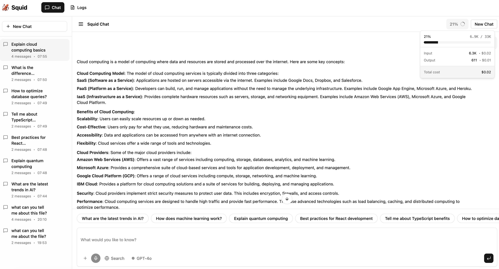

# squid 🦑🏴‍☠️

<div align="center">
  
</div>

An AI-powered assistant for code reviews and improvement suggestions. Privacy-focused and local-first - your code never leaves your hardware when using local models.

> [!WARNING]
> This is an ongoing research project under active development. Features and APIs may change without notice, and breaking changes may occur between versions. Use in production at your own risk.

## Features

- 🌐 **Web UI** - Modern chat interface with persistent sessions and conversation management
- 🧠 **RAG (Retrieval-Augmented Generation)** - Semantic search over your documents for context-aware responses
- ⏰ **Background Jobs** - Schedule recurring AI tasks with cron expressions and resource control
- 🔧 **Tool Calling** - File operations, code search, and bash commands with built-in security
- 🔌 **Plugin System** - Extend capabilities with JavaScript plugins (NEW!)
- 🔍 **AI Code Reviews** - Language-specific analysis and suggestions
- 🌍 **Environment Awareness** - LLM receives system context for smarter responses
- 🔒 **Security First** - Path validation, .squidignore support, and user approval for all operations
- 🔌 **Universal Compatibility** - Works with LM Studio, OpenAI, Ollama, Mistral, and other OpenAI-compatible APIs

## Privacy & Local-First

**Your code never leaves your hardware** when using local LLM services (LM Studio, Ollama, etc.).

- 🔒 **Complete Privacy** — Run models entirely on your own machine with local-first inference
- 🛡️ **You Control Your Data** — Choose between local models (private) or cloud APIs (convenient)
- 🔐 **Secure by Default** — All file operations require explicit approval regardless of LLM service

**Privacy Options:**
| Approach | Examples | Data Sent Externally |
|----------|----------|---------------------|
| Maximum Privacy | LM Studio, Ollama, Docker AI | None |
| Cloud Convenience | OpenAI, Mistral, OpenRouter | Yes, to provider |

## Prerequisites

**Docker (recommended):** Only Docker Desktop 4.34+ or Docker Engine with Docker Compose v2.38+. All AI models are automatically managed.

**Manual installation:**
1. **Rust toolchain:** `curl --proto '=https' --tlsv1.2 -sSf https://sh.rustup.rs | sh`
2. **An OpenAI-compatible LLM service** — see [LLM Provider Reference](#llm-provider-reference) at the bottom of this page

## Installation

### Docker with AI Models (Recommended)

The easiest way to get started — automated setup with helpful checks:

```bash
git clone https://github.com/DenysVuika/squid.git
cd squid
cp .env.docker.example .env
./docker-setup.sh setup   # or: docker compose up -d
```

The setup script verifies Docker, checks disk space, builds the server image, pulls AI models, and starts services with health checks.

**Services included:**
- **Squid server** (web UI + API) on http://localhost:3000
- **Qwen2.5-Coder 7B** (~4GB) — Main LLM with Metal GPU acceleration on Apple Silicon
- **Nomic Embed Text v1.5** (~270MB) — Embeddings for RAG

**Useful commands:**
```bash
./docker-setup.sh status    # Check service status
./docker-setup.sh logs      # View logs
./docker-setup.sh stop      # Stop services
./docker-setup.sh restart   # Restart services
./docker-setup.sh update    # Update models and images
```

#### Using External LLM Services (Optional)

Replace Docker AI models by editing the `environment` section in `docker-compose.yml`:

```yaml
services:
  squid:
    environment:
      # For LM Studio (running on host)
      - API_URL=http://host.docker.internal:1234/v1
      # For Ollama
      # - API_URL=http://host.docker.internal:11434/v1
      # For OpenAI
      # - API_URL=https://api.openai.com/v1
      # - API_KEY=your-api-key-here
```

Use `host.docker.internal` to access services on your Mac/PC from inside Docker. Environment variables in `docker-compose.yml` always override `squid.config.json`.

#### Workspace Directory

The `WORKSPACE_DIR` env var controls what host directory is mounted into the container at `/workspace`. By default, it mounts the current directory.

```bash
# Work with a specific project
WORKSPACE_DIR=~/Projects/my-app docker compose up -d
```

All file operations, code search, and plugin access are restricted to the workspace directory and respect `.squidignore` patterns. See [Security Features](docs/SECURITY.md) for details.

### From crates.io

```bash
cargo install squid-rs
```

### From Source

```bash
git clone https://github.com/DenysVuika/squid.git && cd squid && cargo install --path .
```

### For Development

```bash
cargo build --release
# Use `cargo run --` instead of `squid` in examples below
```

**Web UI**: Automatically built during Rust compilation via `build.rs`. Manual build: `cd web && npm install && npm run build`.

## Configuration

### Manual Installation

For manual installations, configure Squid to connect to your LLM service:

**Quick Setup:**

```bash
# Interactive configuration (recommended)
squid init

# Or use command-line flags to skip prompts
squid init --url http://127.0.0.1:1234/v1 --log-level info
```

This creates a `squid.config.json` file with:
- **API endpoint configuration**: Connection to your LLM service
- **Default agents**: Pre-configured `general-assistant` (full access) and `code-reviewer` (read-only)
- **Context window settings**: Applied to each agent (can be customized per-agent later)
- **Optional RAG setup**: Document search and retrieval features

**Note**: CLI commands (`squid ask`, `squid review`) work with either:
- A `squid.config.json` file (recommended for agent configurations)
- Environment variables in a `.env` file (minimum: `API_URL`)
- A combination of both (environment variables override config file)

If neither is configured, commands will suggest running `squid init` or setting up environment variables.

See [CLI Reference - Init Command](docs/CLI.md#init-command) for full configuration documentation.

### Configuration Options

| Variable | Default | Description |
|----------|---------|-------------|
| `API_URL` | — | OpenAI-compatible API endpoint (required) |
| `API_KEY` | — | API key (`not-needed` for local services) |
| `SQUID_CONTEXT_WINDOW` | `8192` | Max context tokens (see [Context Window Sizes](#common-context-window-sizes)) |
| `SQUID_LOG_LEVEL` | `error` | Console verbosity: `error`, `warn`, `info`, `debug`, `trace` |
| `SQUID_DB_LOG_LEVEL` | `debug` | Database log level (viewable in Web UI Logs page) |
| `SQUID_DATABASE_PATH` | `squid.db` | SQLite database path (auto-detected if relative) |
| `SQUID_WORKING_DIR` | `./workspace` | Root directory for file operations and plugin access |
| `server.allow_network` | `false` | Bind to `0.0.0.0` for LAN access (default: `127.0.0.1` only) |
| `web.sounds` | `true` | Enable notification sounds in Web UI |
| `jobs.enabled` | `false` | Enable background job scheduler |
| `jobs.max_concurrent_jobs` | `2` | Maximum concurrent job executions |
| `jobs.max_cpu_percent` | `70` | CPU threshold before jobs pause |
| `jobs.default_retries` | `3` | Retry attempts for failed jobs |

**Template Variables**: Agent prompts support Tera template syntax (`{{persona}}`, `{{os}}`, `{{arch}}`, `{{now}}`, etc.). See [docs/TEMPLATE-VARIABLES.md](docs/TEMPLATE-VARIABLES.md) for the full list and examples.

### Agents

Squid uses an **agent-based architecture** where each agent has its own model, system prompt, and tool permissions. Agents are defined as individual `.md` files with YAML frontmatter in an `agents/` folder.

**Agent File Example (`agents/code-reviewer.md`):**

```yaml
---
name: Code Reviewer
enabled: true
description: Reviews code for best practices and potential issues
model: anthropic/claude-sonnet-4-5
context_window: 200000
pricing_model: gpt-4o
permissions:
  - now
  - read_file
  - grep
suggestions:
  - Review this file for security vulnerabilities
  - What are the biggest code quality issues here?
---
You are a code reviewer. Focus on security, performance, and maintainability.
```

**Agent Properties:**

| Property | Required | Description |
|----------|----------|-------------|
| `name` | Yes | Display name in the UI |
| `enabled` | No | Show in agent selector (default: `true`) |
| `description` | No | Brief explanation of agent's purpose |
| `model` | Yes | LLM model ID (use `provider/model` for cloud services) |
| `pricing_model` | No | Cloud model ID for cost estimation (e.g., `gpt-4o`) |
| `context_window` | No | Max context tokens (overrides global setting) |
| `use_tools` | No | Enable tool usage (default: `true`, set `false` for persona-only agents) |
| `suggestions` | No | Clickable prompt chips shown in Web UI |
| `permissions` | Yes | Allow-only list of tools (everything else denied by default) |

**Permissions:**
- Supports granular bash permissions (e.g., `"bash:ls"`, `"bash:git status"`)
- Wildcard `"plugin:*"` grants access to all plugins
- ⚠️ Dangerous bash commands (`rm`, `sudo`, `chmod`, `dd`, `curl`, `wget`, `kill`) are **always blocked** regardless of permissions

**Agents Directory Resolution:**
1. `SQUID_AGENTS_DIR` env var (explicit override)
2. `agents/` folder relative to `squid.config.json`
3. `agents/` in the current working directory
4. Bundled agents shipped with the executable

The `default_agent` field in `squid.config.json` specifies which agent is selected by default when starting a new session.

**Example Agent Workflows:**

| Agent | Permissions | Use Case |
|-------|-------------|----------|
| Code Reviewer | `read_file`, `grep` | Review code without making changes |
| General Assistant | All tools | Full-featured coding assistant |
| Terminal Assistant | `bash:ls`, `bash:git`, `now` | Bash operations with specific command allowlists |
| Persona Agent | `use_tools: false` | Custom personalities (e.g., pirate, bard) |

### Common Context Window Sizes

<details>
<summary><b>📊 Click to expand - Context window sizes for popular models</b></summary>

| Model | Context Window | Config Value |
|-------|---------------|--------------|
| **Qwen2.5-Coder-7B** | 32K tokens | `32768` |
| **GPT-4** | 128K tokens | `128000` |
| **GPT-4o** | 128K tokens | `128000` |
| **GPT-3.5-turbo** | 16K tokens | `16385` |
| **Claude 3 Opus** | 200K tokens | `200000` |
| **Claude 3.5 Sonnet** | 200K tokens | `200000` |
| **Llama 3.1-8B** | 128K tokens | `131072` |
| **Mistral Large** | 128K tokens | `131072` |
| **DeepSeek Coder** | 16K tokens | `16384` |
| **CodeLlama** | 16K tokens | `16384` |

**How to find your model's context window:**
1. Check your model's documentation on Hugging Face
2. Look in the model card or `config.json`
3. Check your LLM provider's documentation
4. For LM Studio: Look at the model details in the UI

**Why it matters:**
- ✅ Real-time utilization percentage (e.g., "45% of 32K context used")
- ✅ Prevents API errors from exceeding model capacity
- ✅ Accurate token usage statistics displayed in web UI
- ✅ Better planning for long conversations

**Setting agent-specific context windows:**

After running `squid init`, edit `squid.config.json` to set context windows per agent:

```json
{
  "agents": {
    "general-assistant": {
      "model": "local-model",
      "context_window": 32768,  // Qwen2.5-Coder: 32K
      ...
    },
    "code-reviewer": {
      "model": "gpt-4",
      "context_window": 128000,  // GPT-4: 128K
      ...
    }
  }
}
```

</details>

## Usage

Squid provides both a modern Web UI and a command-line interface. **We recommend the Web UI** for the best experience.

### Squid Web UI (Recommended)



*Modern chat interface with session management, token usage tracking, and real-time cost estimates*

#### Starting the Web UI

**Docker:**
```bash
docker compose up -d   # http://localhost:3000
WORKSPACE_DIR=/path/to/project docker compose up -d  # custom workspace
```

**Manual:**
```bash
squid serve                          # http://127.0.0.1:8080
squid serve --port 3000 --db=custom.db --dir=/path/to/project
```

**Server Options:**
| Flag | Default | Description |
|------|---------|-------------|
| `--port` / `-p` | `8080` (`3000` in Docker) | Server port |
| `--db` | `squid.db` | Custom database path |
| `--dir` | `./workspace` | Working directory override |

**Web UI Features:**
- 📊 **Token usage indicator** — Real-time context utilization (e.g., "5.6% • 7.1K / 128K")
- 💰 **Cost tracking** — Estimates for both cloud and local models
- 📈 **Lifetime agent statistics** — Accumulated token usage and cost savings
- 🗂️ **Session sidebar** — Browse, rename, and switch between past conversations
- ✏️ **Auto-generated titles** — Sessions titled from first message, editable inline
- 📎 **Multi-file attachments** — Add context from multiple files
- 🔍 **Logs page** — Filterable application logs with pagination and session tracking

**Web UI Development (Hot Reload):**
```bash
# Terminal 1 - Backend
cargo run serve --port 8080
# Terminal 2 - Frontend
cd web && npm run dev
```
Open `http://localhost:5173`. Changes appear instantly. Production build: `cd web && npm run build`.

### Command-Line Interface

For advanced users and automation, Squid provides a full CLI. See the [CLI Reference](docs/CLI.md) for detailed documentation on:

- **`squid ask`** - Ask questions with optional file context
- **`squid review`** - Review code with language-specific analysis
- **`squid rag`** - Manage RAG document indexing
- **`squid logs`** - View, clear, and clean up application logs
- **`squid init`** - Initialize project configuration
- **`squid doctor`** - Run diagnostic checks to verify setup

**Configuration Requirement**: Most CLI commands (`ask`, `review`, `serve`) require either a `squid.config.json` file OR essential environment variables (at minimum `API_URL`). You can:
- Run `squid init` to create a config file with agent configurations
- Use a `.env` file with environment variables like `API_URL`, `API_KEY`, etc.
- Mix both approaches (environment variables override config file settings)

**Quick Examples:**

```bash
# Ask a question (uses default agent)
squid ask "What is Rust?"

# Ask with specific agent
squid ask "What is Rust?" --agent code-reviewer

# Review a file (uses default agent)
squid review src/main.rs

# Review with specific agent
squid review src/main.rs --agent general-assistant

# Initialize RAG for a project
squid rag init

# View application logs
squid logs show --level error

# Clear all logs from database
squid logs reset

# Remove logs older than 30 days (default)
squid logs cleanup

# Remove logs older than 7 days
squid logs cleanup --max-age-days 7

# Verify configuration and setup
squid doctor
```

For complete CLI documentation, see [docs/CLI.md](docs/CLI.md).

### RAG (Retrieval-Augmented Generation)

Squid includes RAG capabilities for semantic search over your documents, enabling context-aware AI responses using your own documentation.

**Quick Start:**

```bash
# Docker (already configured)
docker compose up -d

# Or manually setup
mkdir documents
cp docs/*.md documents/
squid rag init
squid serve
# Click the RAG toggle (🔍) in the Web UI
```

**Features:**
- 📚 **Semantic search** over your documentation
- 🔍 **One-click toggle** in Web UI
- 💾 **Persistent knowledge base** - index once, query many times
- 📎 **Source attribution** - see which documents were used
- 🔄 **Auto-indexing** - supports Markdown, code, configs, and more

**Using RAG:**
1. Add documents to `./documents` directory
2. Run `squid rag init` to index them
3. Toggle RAG in the Web UI to enable semantic search
4. Ask questions about your documentation

For complete RAG documentation, see [docs/RAG.md](docs/RAG.md).

### Background Jobs

Automate recurring AI tasks with cron scheduling and resource control.

**Quick Start:**

```json
// squid.config.json
{
  "jobs": {
    "enabled": true,
    "max_concurrent_jobs": 2,
    "max_cpu_percent": 70
  }
}
```

**Create a daily code review job:**

```bash
curl -X POST http://localhost:8080/api/jobs \
  -H "Content-Type: application/json" \
  -d '{
    "name": "Daily Review",
    "schedule_type": "cron",
    "cron_expression": "0 9 * * 1-5",
    "payload": {
      "agent_id": "code-reviewer",
      "message": "Review recent changes"
    }
  }'
```

**Features:**
- ⏰ **Cron scheduling** - Recurring tasks on custom schedules
- 🚀 **One-off tasks** - Immediate background jobs
- 🎯 **Priority queue** - Higher priority jobs execute first
- 🛡️ **Resource control** - CPU monitoring and concurrency limits
- 📡 **Real-time updates** - SSE streaming for job status
- 💾 **Persistent storage** - Jobs survive server restarts
- 🔄 **Automatic retries** - Failed jobs retry with backoff

**Web UI Management:**

- View all jobs in the sidebar with live status updates
- Click any job to see detailed execution history
- Interactive controls: pause, resume, trigger, delete
- Per-execution metrics: duration, tokens used, cost
- Direct links to conversation sessions

**CLI Commands:**

```bash
squid jobs list                    # List all jobs
squid jobs show <id>              # View job details
squid jobs create                 # Interactive job creation
squid jobs delete <id>            # Delete a job
squid jobs pause <id>             # Pause a cron job
squid jobs resume <id>            # Resume a paused job
squid jobs trigger <id>           # Manually trigger a cron job
```

For complete documentation, see [docs/JOBS.md](docs/JOBS.md) and [docs/CLI.md](docs/CLI.md#jobs-commands).


**Database & Persistence:**
- All chat sessions, messages, and logs are automatically saved to `squid.db` (SQLite database)
- Sessions persist across server restarts - your conversation history is always preserved
- The database location is automatically detected based on config file location, existing databases in parent directories, or the current working directory. Override with `SQUID_DATABASE_PATH`.

### REST API

The web server exposes REST API endpoints for programmatic access. See [docs/API.md](docs/API.md) for full documentation.

| Endpoint | Method | Description |
|----------|--------|-------------|
| `/api/chat` | POST | Send a message (SSE streaming response) |
| `/api/sessions` | GET | List all sessions |
| `/api/sessions/{id}` | GET | Load session history |
| `/api/sessions/{id}` | PATCH | Rename session |
| `/api/sessions/{id}` | DELETE | Delete session |
| `/api/logs` | GET | View application logs |
| `/api/agents` | GET | List configured agents |
| `/api/jobs` | GET | List all background jobs |
| `/api/jobs` | POST | Create a background job |
| `/api/jobs/{id}` | GET | Get job details |
| `/api/jobs/{id}` | DELETE | Cancel a job |

### Tool Calling & Security

Squid's LLM can intelligently use tools (read files, write files, search code, execute safe commands) when needed. All tool operations are protected by multiple security layers and require user approval.

**Security Features:**
- 🛡️ **Path Validation** - Blocks system directories automatically
- 📂 **Ignore Patterns** - `.squidignore` file (like `.gitignore`)
- 🔒 **User Approval** - Manual confirmation for each operation
- 💻 **Safe Bash** - Dangerous commands always blocked

**Available Tools:**
- 📖 **read_file** - Read file contents
- 📝 **write_file** - Write to files with preview
- 🔍 **grep** - Search code with regex
- 🕐 **now** - Get current date/time
- 💻 **bash** - Execute safe commands (ls, git, cat, etc.)

For complete security and tool usage documentation, see [docs/SECURITY.md](docs/SECURITY.md).

## Plugin System

Squid supports a powerful JavaScript-based plugin system that lets you extend its capabilities with custom tools. Plugins are invoked by the LLM alongside built-in tools.

### Quick Start

**1. Create a plugin:**

```bash
mkdir -p plugins/my-plugin
cd plugins/my-plugin
```

**2. Add `plugin.json`:**

```json
{
  "id": "my-plugin",
  "title": "My Plugin",
  "description": "Does something useful",
  "version": "0.1.0",
  "api_version": "1.0",
  "security": {
    "requires": ["read_file"],
    "network": false,
    "file_write": false
  },
  "input_schema": {
    "type": "object",
    "properties": {
      "message": { "type": "string" }
    },
    "required": ["message"]
  },
  "output_schema": {
    "type": "object",
    "properties": {
      "result": { "type": "string" }
    },
    "required": ["result"]
  }
}
```

**3. Add `index.js`:**

```javascript
function execute(context, input) {
    context.log(`Processing: ${input.message}`);
    return { result: input.message.toUpperCase() };
}
globalThis.execute = execute;
```

**4. Enable in config:**

```json
{
  "agents": {
    "general-assistant": {
      "permissions": {
        "allow": ["read_file", "plugin:*"]
      }
    }
  }
}
```

### Features

- **🔌 Sandboxed Execution** - QuickJS runtime with memory and CPU limits
- **🔒 Hybrid Security** - Plugins declare needs, agents control access
- **✅ Schema Validation** - JSON Schema for input/output
- **📁 Dual Location** - Workspace (`./plugins/`) and global (`~/.squid/plugins/`)
- **🛠️ Context API** - Safe file operations, logging, and HTTP (when permitted)

### Example Plugins

Three example plugins are included:
- **markdown-linter** - Analyzes markdown files for style issues
- **code-formatter** - Formats code with basic rules
- **http-fetcher** - Fetches content from URLs

### Testing Plugins

**Test code-formatter** (fully functional):
```bash
squid chat
> Format this JSON: {"name":"test","age":30}
```

**Test markdown-linter** (fully functional, reads files):
```bash
squid chat
> Lint the README.md file
```

**Test http-fetcher** (requires network permission):
```bash
squid chat
> Fetch content from https://api.github.com
```

**Note**: The http-fetcher plugin requires `network: true` permission in its `plugin.json`. All context APIs (`readFile`, `writeFile`, `httpGet`) are now fully implemented and functional.

See [docs/PLUGINS.md](docs/PLUGINS.md) for complete plugin documentation.

## Documentation

- **[Quick Start Guide](docs/QUICKSTART.md)** - Get started in 5 minutes
- **[CLI Reference](docs/CLI.md)** - Complete command-line interface documentation
- **[Plugin Development Guide](docs/PLUGINS.md)** - Create custom JavaScript tools (NEW!)
- **[RAG Guide](docs/RAG.md)** - Retrieval-Augmented Generation (semantic document search)
- **[Background Jobs](docs/JOBS.md)** - Schedule recurring AI tasks with cron expressions (NEW!)
- **[Security Features](docs/SECURITY.md)** - Tool approval and security safeguards
- **[System Prompts Reference](docs/PROMPTS.md)** - Guide to all system prompts and customization
- **[Examples](docs/EXAMPLES.md)** - Comprehensive usage examples and workflows
- **[Changelog](CHANGELOG.md)** - Version history and release notes
- **[Sample File](sample-files/sample.txt)** - Test file for trying out the file context feature
- **[Example Files](sample-files/README.md)** - Test files for code review prompts
- **[AI Agents Guide](AGENTS.md)** - Instructions for AI coding assistants working on this project

### Testing

```bash
./tests/test-reviews.sh       # Automated code review tests
./tests/test-security.sh      # Interactive security approval tests
squid review sample-files/example.rs  # Test individual review
```

See [tests/README.md](tests/README.md) and [sample-files/README.md](sample-files/README.md) for details.


## LLM Provider Reference

| Provider | API URL | API Key | Setup Guide |
|----------|---------|---------|-------------|
| **LM Studio** | `http://127.0.0.1:1234/v1` | `not-needed` | [lmstudio.ai](https://lmstudio.ai/) |
| **Ollama** | `http://localhost:11434/v1` | `not-needed` | [ollama.com](https://ollama.com/) |
| **Docker Model Runner** | `http://localhost:12434/engines/v1` | `not-needed` | Docker Desktop AI tab |
| **OpenAI** | `https://api.openai.com/v1` | Your key | [platform.openai.com](https://platform.openai.com/api-keys) |
| **Mistral AI** | `https://api.mistral.ai/v1` | Your key | [console.mistral.ai](https://console.mistral.ai/) |
| **OpenRouter** | `https://openrouter.ai/api/v1` | Your key | [openrouter.ai](https://openrouter.ai/) |
| **Groq** | `https://api.groq.com/openai/v1` | Your key | [groq.com](https://groq.com/) |

Set `API_URL` and `API_KEY` in your `.env` file or via `squid init`. All providers use the OpenAI-compatible API format.

## License

Apache-2.0 License. See `LICENSE` file for details.
