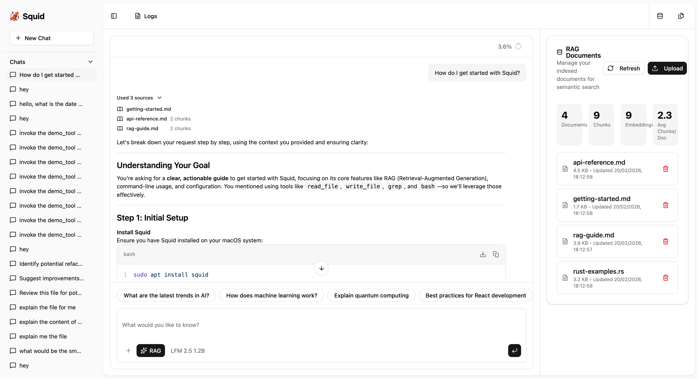

# RAG (Retrieval-Augmented Generation)

Squid includes RAG capabilities for semantic search over your documents, enabling context-aware AI responses using your own documentation.

## Table of Contents

- [What is RAG?](#what-is-rag)
- [Prerequisites](#prerequisites)
- [Quick Start](#quick-start)
- [CLI Commands](#cli-commands)
- [Web UI Integration](#web-ui-integration)
- [Supported File Types](#supported-file-types)
- [How It Works](#how-it-works)
- [Configuration Options](#configuration-options)
- [API Endpoints](#api-endpoints)
- [Best Practices](#best-practices)
- [Troubleshooting](#troubleshooting)

## What is RAG?

RAG (Retrieval-Augmented Generation) enhances AI responses by searching through your documents to find relevant context before generating answers. This allows the AI to provide accurate, project-specific information based on your own documentation, code comments, guides, and notes.

**Benefits:**
- 📚 **Context-aware responses** - AI answers based on your actual documentation
- 🎯 **Project-specific knowledge** - No need to paste docs into every prompt
- 🔍 **Semantic search** - Finds relevant content even with different wording
- 💾 **Persistent knowledge base** - Index once, query many times
- 🔄 **Automatic updates** - Re-index when documents change

## Prerequisites

RAG requires an embedding model for generating vector representations of your documents.

### Using Docker (Recommended)

If you're using Docker Compose, RAG is already configured with the Nomic Embed Text v1.5 model. No additional setup needed!

```bash
docker compose up -d
# RAG is ready to use at http://localhost:3000
```

### Manual Setup

For manual installations, you need an OpenAI-compatible embedding API:

**Option 1: LM Studio (Recommended)**

1. **Download an embedding model**:
   - Search for: `text-embedding-nomic-embed-text-v1.5`
   - Or browse: https://huggingface.co/models?search=embedding

2. **Start LM Studio's local server**:
   - Load the embedding model
   - Start the server (default: `http://127.0.0.1:1234`)
   - **Note**: Use base URL without `/v1` suffix for embeddings

**Option 2: Ollama**

```bash
# Pull an embedding model
ollama pull nomic-embed-text

# Start Ollama service
ollama serve
```

**Option 3: Docker Model Runner**

```bash
# Pull embedding model
docker model pull hf.co/nomic-ai/nomic-embed-text-v1.5-GGUF

# Verify it's running
docker model ls
```

**Option 4: Cloud Services**

- **OpenAI**: Use `text-embedding-3-small` or `text-embedding-ada-002`
- **Mistral**: Use `mistral-embed`
- Any OpenAI-compatible embedding API

### Configuration

Add RAG configuration to `squid.config.json`:

```json
{
  "rag": {
    "enabled": true,
    "embedding_model": "text-embedding-nomic-embed-text-v1.5",
    "embedding_url": "http://127.0.0.1:1234",
    "chunk_size": 512,
    "chunk_overlap": 50,
    "top_k": 5,
    "documents_path": "documents"
  }
}
```

## Quick Start

### 1. Create Documents Directory

```bash
mkdir documents
# Add your markdown files, code docs, guides, etc.
cp docs/*.md documents/
cp README.md documents/
```

### 2. Index Your Documents

```bash
# Using Docker
docker compose exec squid /app/squid rag init

# Or manually
squid rag init
```

### 3. Query with RAG

**Web UI:**
```bash
squid serve
# Open http://localhost:3000
# Click the RAG toggle button (🔍 icon) in the chat input
# Ask questions about your docs!
```

**CLI:**
```bash
squid ask "How do I configure the database?"
# RAG automatically searches your documents for relevant context
```

## Automatic File Monitoring

When RAG is enabled and the server is running, Squid automatically monitors the documents directory for changes:

- **Automatic Reindexing**: Files are automatically reindexed when created, modified, or deleted
- **No Manual Intervention**: No need to run `squid rag init` after updating documents
- **Background Processing**: Runs continuously while the server is active
- **Real-time Updates**: Changes are detected within seconds and reflected in search results

**How it works:**
1. Start the server with RAG enabled: `squid serve`
2. The document watcher starts monitoring `documents_path` (default: `./documents`)
3. Add, edit, or delete files in the documents directory
4. Files are automatically reindexed in the background
5. New content is immediately available in RAG queries

**Example workflow:**
```bash
# Start server (watcher starts automatically)
squid serve

# In another terminal, add a new document
echo "# New Feature\nThis is a new feature." > documents/new-feature.md

# The file is automatically indexed
# Now you can query it immediately in the Web UI or CLI
```

**Note:** The document watcher only runs when the server is active (`squid serve`). For CLI-only workflows, use `squid rag init` to manually reindex documents.

## CLI Commands

### Initialize and Index

```bash
# Index documents from default directory (./documents)
squid rag init

# Index from custom directory
squid rag init --dir /path/to/docs

# Using Docker
docker compose exec squid /app/squid rag init
```

**What it does:**
- Scans the documents directory recursively
- Chunks each file into manageable pieces
- Generates embeddings for each chunk
- Stores vectors in SQLite database

### List Indexed Documents

```bash
# List all indexed documents
squid rag list

# List for specific directory
squid rag list --dir /path/to/docs
```

**Output:**
```
Indexed Documents:
  • README.md (10 chunks, 5,120 tokens)
  • docs/SECURITY.md (8 chunks, 4,096 tokens)
  • docs/CLI.md (15 chunks, 7,680 tokens)
Total: 3 documents, 33 chunks
```

### View Statistics

```bash
# View stats for current directory
squid rag stats

# View stats for specific directory
squid rag stats --dir /path/to/docs
```

**Output:**
```
RAG Statistics:
  Documents: 12
  Total Chunks: 156
  Total Tokens: ~79,872
  Average Chunk Size: 512 tokens
  Storage Size: 2.4 MB
  Last Updated: 2024-02-21 14:30:00
```

### Rebuild Index

```bash
# Clear and re-index everything
squid rag rebuild

# Rebuild from custom directory
squid rag rebuild --dir /path/to/docs
```

**When to rebuild:**
- After changing `chunk_size` or `chunk_overlap` in config
- After updating many documents
- If search results seem stale or incorrect
- To switch embedding models

## Web UI Integration



*Native RAG toggle button in the prompt input toolbar - enable/disable document search with one click*

### Uploading Documents

The Web UI provides a document upload interface for adding files to your RAG index:

1. Click the upload button in the RAG section
2. Select files to upload (supports all [supported file types](#supported-file-types))
3. Files are saved to the configured `documents_path` directory
4. The document watcher automatically indexes files within 1-2 seconds
5. Statistics automatically update to reflect the new content

**Note:** When the server is running, uploaded files are automatically indexed by the background document watcher. Statistics refresh automatically after indexing completes.

### Features

- **🔍 Native Toggle Button**: Enable/disable RAG with a single click in the prompt input toolbar
- **💾 Persistent State**: RAG toggle state is saved and restored between sessions
- **🎯 Automatic Context**: RAG automatically enhances queries with relevant document context
- **📎 Source Attribution**: Responses show which documents were used
- **📊 Real-time Feedback**: Visual indicator shows when RAG is active

### Using RAG in Web UI

1. **Start the server**:
   ```bash
   squid serve
   # or
   docker compose up -d
   ```

2. **Open the Web UI**: Navigate to http://localhost:3000

3. **Enable RAG**: Click the RAG toggle button (🔍 icon) in the chat input toolbar

4. **Ask questions**: Type questions about your documentation
   ```
   "How do I configure authentication?"
   "What are the deployment steps?"
   "Explain the API endpoints"
   ```

5. **View sources**: The assistant's response will include references to source documents used

## Supported File Types

RAG automatically indexes these file types:

### Documentation
- **Markdown**: `.md`, `.markdown`
- **Text**: `.txt`

### Code
- **Rust**: `.rs`
- **TypeScript/JavaScript**: `.ts`, `.js`, `.tsx`, `.jsx`
- **Python**: `.py`, `.pyw`, `.pyi`
- **Go**: `.go`
- **Java**: `.java`
- **C/C++**: `.c`, `.cpp`, `.h`, `.hpp`, `.cc`, `.cxx`
- **Ruby**: `.rb`
- **PHP**: `.php`

### Scripts
- **Shell**: `.sh`, `.bash`, `.zsh`, `.fish`

### Configuration
- **JSON**: `.json`
- **YAML**: `.yaml`, `.yml`
- **TOML**: `.toml`
- **XML**: `.xml`
- **INI**: `.ini`

### Web
- **HTML**: `.html`, `.htm`
- **CSS**: `.css`, `.scss`, `.sass`

### Other
- **SQL**: `.sql`, `.ddl`, `.dml`
- **Docker**: `Dockerfile`, `Dockerfile.*`
- **Make**: `Makefile`, `Makefile.*`

**Note**: Binary files and unsupported formats are automatically skipped during indexing.

## How It Works

### 1. Document Chunking

Files are split into manageable chunks with configurable size and overlap:

```
Document: "This is a long document about Rust programming..."

Chunk 1: "This is a long document about Rust programming..."
Chunk 2: "...Rust programming and its memory safety features..."
Chunk 3: "...memory safety features make it ideal for systems..."
```

**Benefits of chunking:**
- Manageable context size for embeddings
- Overlap preserves continuity between chunks
- Better retrieval accuracy

### 2. Embedding Generation

Each chunk is converted to a vector embedding using the configured model:

```
Chunk: "Rust has zero-cost abstractions"
  ↓ (embedding model)
Vector: [0.123, -0.456, 0.789, ..., 0.234] (768 dimensions for Nomic)
```

### 3. Vector Storage

Embeddings are stored in SQLite using the `sqlite-vec` extension:

```sql
CREATE TABLE IF NOT EXISTS rag_documents (
    id INTEGER PRIMARY KEY,
    filename TEXT NOT NULL,
    content TEXT NOT NULL,
    chunk_index INTEGER NOT NULL,
    embedding BLOB NOT NULL
);
```

### 4. Semantic Search

When you ask a question:

1. Your query is embedded into a vector
2. Vector similarity search finds the most relevant chunks (L2 distance)
3. Top-k chunks are retrieved and ranked
4. Relevant context is formatted and sent to the LLM

```
Query: "How do I configure authentication?"
  ↓ (embedding)
Query Vector: [0.234, -0.567, 0.891, ...]
  ↓ (similarity search)
Top Results:
  1. docs/SECURITY.md#L45-60 (distance: 0.12)
  2. README.md#L234-250 (distance: 0.18)
  3. docs/CONFIG.md#L89-105 (distance: 0.23)
  ↓ (format context)
LLM Prompt: "Based on these documents: [context], answer: How do I configure authentication?"
```

### 5. Context Retrieval

The LLM receives your question plus the relevant document chunks, enabling accurate, context-aware responses.

## Configuration Options

| Option | Default | Description |
|--------|---------|-------------|
| `enabled` | `true` | Enable/disable RAG features globally |
| `embedding_model` | `"text-embedding-nomic-embed-text-v1.5"` | Model name for generating embeddings |
| `embedding_url` | `"http://127.0.0.1:1234"` | OpenAI-compatible embedding API URL (base URL without /v1) |
| `chunk_size` | `512` | Size of document chunks in tokens |
| `chunk_overlap` | `50` | Overlap between chunks in tokens |
| `top_k` | `5` | Number of results to retrieve per query |
| `documents_path` | `"documents"` | Path to documents directory (relative to working directory) |

### Tuning Parameters

**`chunk_size`**
- **Smaller (256-512)**: Faster indexing, more granular results, higher storage
- **Larger (1024-2048)**: Slower indexing, more context per chunk, lower storage
- **Recommended**: 512 for most use cases

**`chunk_overlap`**
- **Purpose**: Prevents important information from being split across chunks
- **Too small (0-25)**: Risk of losing context at boundaries
- **Too large (100+)**: Redundant storage, slower indexing
- **Recommended**: 50-100 tokens

**`top_k`**
- **Smaller (1-3)**: Faster, less context, more focused
- **Larger (10-20)**: Slower, more context, potentially noisy
- **Recommended**: 5-7 for most queries

## API Endpoints

The RAG system exposes REST API endpoints for programmatic access:

### Query for Context

**Endpoint**: `POST /api/rag/query`

**Request:**
```json
{
  "query": "How do I configure authentication?",
  "top_k": 5
}
```

**Response:**
```json
{
  "results": [
    {
      "filename": "docs/SECURITY.md",
      "content": "Authentication is configured via...",
      "score": 0.12,
      "chunk_index": 3
    }
  ]
}
```

### List Documents

**Endpoint**: `GET /api/rag/documents`

**Response:**
```json
{
  "documents": [
    {
      "filename": "README.md",
      "chunks": 10,
      "tokens": 5120,
      "indexed_at": "2024-02-21T14:30:00Z"
    }
  ]
}
```

### Get Statistics

**Endpoint**: `GET /api/rag/stats`

**Response:**
```json
{
  "total_documents": 12,
  "total_chunks": 156,
  "total_tokens": 79872,
  "average_chunk_size": 512,
  "storage_size_bytes": 2516582,
  "last_updated": "2024-02-21T14:30:00Z"
}
```

### Delete Document

**Endpoint**: `DELETE /api/rag/documents/{filename}`

**Response:**
```json
{
  "success": true,
  "message": "Document deleted successfully"
}
```

### Upload Document

**Endpoint**: `POST /api/rag/upload`

**Request**: Multipart form data with file

**Response:**
```json
{
  "success": true,
  "filename": "new-doc.md",
  "chunks": 8,
  "message": "Document uploaded and indexed successfully"
}
```

## Best Practices

### Document Organization

**✅ Do:**
- Keep documents focused and well-structured
- Use clear headings and sections
- Include relevant keywords in your documentation
- Organize docs by topic or module
- Use consistent formatting (Markdown headings, etc.)

**❌ Don't:**
- Mix unrelated topics in one file
- Use very long documents without structure
- Rely on visual formatting (tables work better as lists)
- Include large code dumps without explanation

### Content Guidelines

**For best RAG results:**

1. **Use descriptive headings**: `## Authentication Configuration` instead of `## Setup`
2. **Include keywords**: Mention synonyms and related terms
3. **Add context**: Explain "why" not just "how"
4. **Structure hierarchically**: Use heading levels meaningfully
5. **Keep paragraphs focused**: One topic per paragraph

### Performance Optimization

**Indexing:**
- Start with default settings (chunk_size: 512, overlap: 50)
- Index incrementally rather than all at once for large doc sets
- Use `rag rebuild` sparingly (only when needed)

**Querying:**
- Keep `top_k` reasonable (5-7 is usually enough)
- Use specific queries rather than vague questions
- Enable RAG only when you need document context

**Storage:**
- Periodically clean up old/outdated documents
- Use `.squidignore` to exclude temporary or generated files
- Consider separate document directories for different projects

### Workflow Integration

**Daily Development:**
```bash
# Morning: Update docs and re-index
vim docs/API.md
squid rag rebuild

# During work: Query as needed
squid ask "What's the API endpoint for authentication?"
```

**Documentation Updates:**
```bash
# After documentation changes
git commit docs/
squid rag rebuild
```

**Project Onboarding:**
```bash
# Set up RAG for new project
cd my-project
mkdir documents
cp docs/*.md documents/
squid rag init

# New team members can now query
squid ask "How do I set up the development environment?"
```

## Troubleshooting

### No Results Found

**Problem**: RAG queries return no relevant results

**Solutions:**
1. Check if documents are indexed: `squid rag list`
2. Verify embedding service is running: `curl http://localhost:1234/v1/models`
3. Rebuild the index: `squid rag rebuild`
4. Try more specific queries with keywords from your docs

### Incorrect or Irrelevant Results

**Problem**: RAG returns wrong documents or chunks

**Solutions:**
1. Increase `top_k` to see more results: `"top_k": 10`
2. Reduce `chunk_size` for more granular matching: `"chunk_size": 256`
3. Check if documents contain the information you expect
4. Rebuild index after config changes

### Slow Indexing

**Problem**: `rag init` takes too long

**Solutions:**
1. Reduce `chunk_size` to process faster
2. Index fewer documents at once
3. Check embedding service performance
4. Use faster embedding models (smaller dimension)

### High Storage Usage

**Problem**: `.squid-rag` directory is very large

**Solutions:**
1. Increase `chunk_size` to reduce chunk count
2. Remove unnecessary documents before indexing
3. Use `.squidignore` to exclude large/binary files
4. Clean up old indexes: `rm -rf .squid-rag && squid rag init`

### Embedding Service Errors

**Problem**: Cannot connect to embedding API

**Solutions:**
1. Verify service is running: `curl http://localhost:1234/v1/models`
2. Check `embedding_url` in config (no `/v1` suffix)
3. Ensure embedding model is loaded in LM Studio/Ollama
4. Check firewall/network settings

### Docker-Specific Issues

**Problem**: RAG not working in Docker

**Solutions:**
1. Verify models are pulled: `docker compose pull`
2. Check container logs: `docker compose logs -f squid`
3. Ensure volumes are mounted: `docker compose config`
4. Restart containers: `docker compose restart`

### Database Verification

Verify RAG tables directly in the SQLite database:

```bash
sqlite3 squid.db
.tables                 # Should show: rag_documents, rag_chunks, rag_embeddings
SELECT COUNT(*) FROM rag_documents;
SELECT COUNT(*) FROM rag_chunks;
SELECT COUNT(*) FROM rag_embeddings;
.quit
```

## See Also

- [Main README](../README.md) — Overview and quick start
- [CLI Reference](CLI.md) — Complete CLI documentation
- [Security Features](SECURITY.md) — Security and permissions